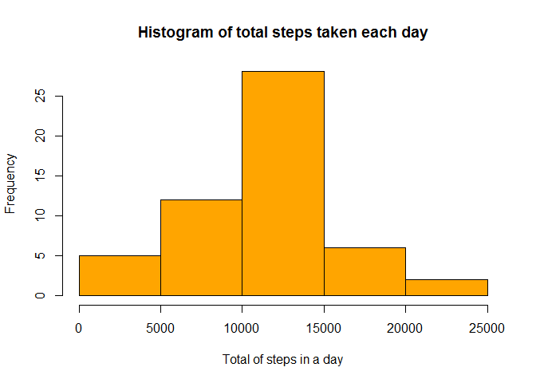
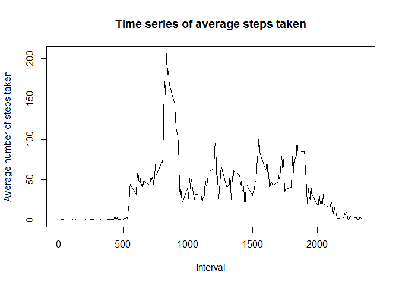
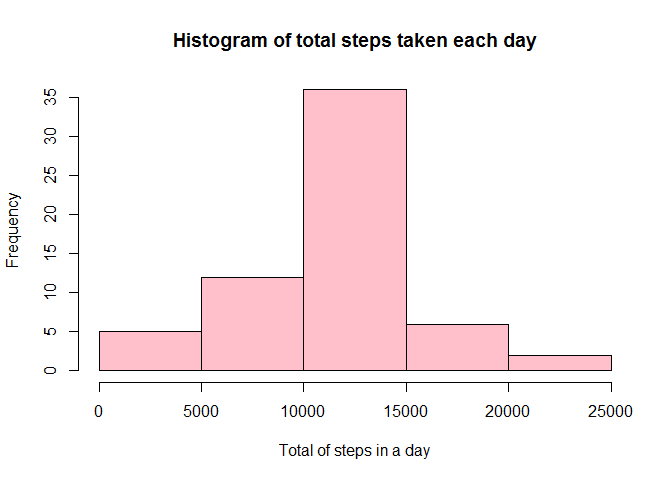
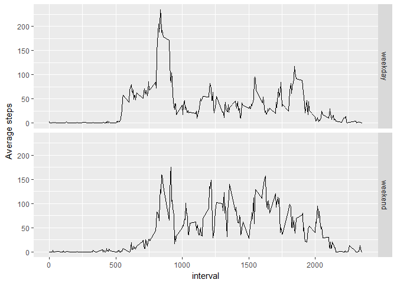

# Reproducible Research: Peer Assessment 1


## Loading required packages


```r
library(lubridate)
library(dplyr)
library(ggplot2)
```

## Loading and preprocessing the data


```r
data<-read.csv("activity.csv")
data<-mutate(data, date=ymd(date))
```

## What is mean total number of steps taken per day?

### Calculate the total number of steps taken per day, make histogram of total number of steps taken each day


```r
Total_steps_by_day<-data %>%
        group_by(date) %>%
        summarise(total=sum(steps))
hist(Total_steps_by_day$total,
        main="Histogram of total steps taken each day", 
        xlab= "Total of steps in a day", 
        col= "orange")
```

<!-- -->

### Calculate and report the mean and median of the total number of steps taken per day


```r
mean<- mean(Total_steps_by_day$total, na.rm=TRUE)
median<-median(Total_steps_by_day$total, na.rm=TRUE)
cat(sprintf("Mean is %.3f \nMedian is %.3f", mean, median))
```

```
## Mean is 10766.189 
## Median is 10765.000
```


## What is the average daily activity pattern?


```r
time_series<-data %>%
        group_by(interval) %>%
        summarise(mean_by_interval=mean(steps, na.rm=TRUE))
plot(time_series$interval, 
     time_series$mean_by_interval, 
     type="l", 
     main="Time series of average steps taken",
     xlab="Interval",
     ylab="Average number of steps taken")
```

<!-- -->

### Which 5-minute interval, on average across all the days in the dataset, contains the maximum number of steps?


```r
max_interval<-time_series$interval[which(time_series$mean_by_interval==max(time_series$mean_by_interval))]
```

The 5 minute interval which has the max number of steps on an average is the variable max_interval evaluated as 835. 

## Imputing missing values

### Calculate and report the total number of missing values in the dataset (i.e. the total number of rows with NAs)


```r
missing_values<- sum(is.na(data$steps))
```

The total number of missing values is the variable missing_values evalueated as 2304. 


```r
data2<-data
vector<-1:dim(data)[1]
pick_rows<-vector[is.na(data$steps)] # the rows that have NA values
for (i in pick_rows){
        interval<- data$interval[i]  #identify time interval associated with that row
        index<-which(time_series$interval==interval)
        data2$steps[i]<-time_series$mean_by_interval[index]
} 
Total_steps_by_day2<-data2 %>%
        group_by(date) %>%
        summarise(total=sum(steps))
hist(Total_steps_by_day2$total,
        main="Histogram of total steps taken each day", 
        xlab= "Total of steps in a day", 
        col= "pink")                
```

<!-- -->

```r
mean2<- mean(Total_steps_by_day2$total, na.rm=TRUE)
median2<-median(Total_steps_by_day2$total, na.rm=TRUE)
cat(sprintf("Mean is %.3f \nMedian is %.3f", mean2, median2))
```

```
## Mean is 10766.189 
## Median is 10766.189
```

```r
cat(sprintf("Difference in mean is %.3f \nDifference in median is %.3f", mean2-mean, median2-median))
```

```
## Difference in mean is 0.000 
## Difference in median is 1.189
```
## Are there differences in activity patterns between weekdays and weekends?


```r
weekday_data<-weekdays(data$date)
Weekday<-c("Monday", "Tuesday", "Wednesday", "Thursday", "Friday")
logical_op<-weekday_data %in% Weekday
data<-mutate(data, day_of_week=factor(logical_op, levels=c(TRUE, FALSE), labels=c("weekday", "weekend")))
weekday_stats<-data %>%
        group_by(interval, day_of_week) %>%
        summarize(mean_steps=mean(steps, na.rm=TRUE))
qplot(interval, mean_steps, data=weekday_stats, facets=day_of_week~., geom="line", ylab="Average steps")
```

<!-- -->
